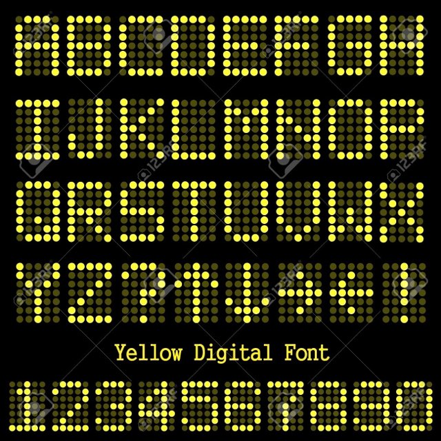
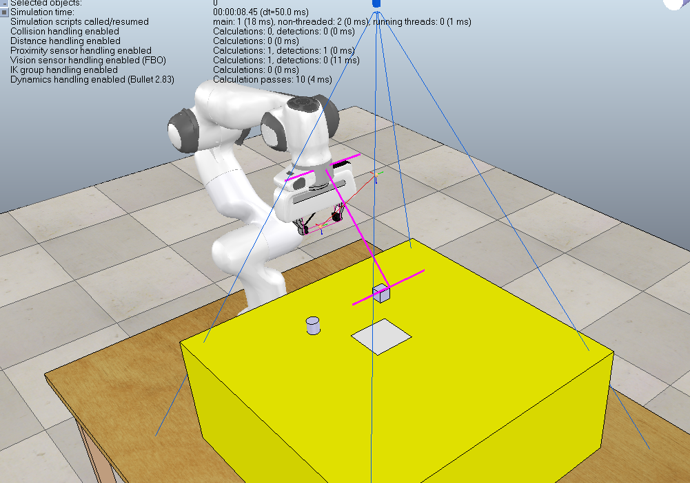

# PyRep Simulation
We will do our project 1 Kinematic Picking, project 2 Simulated Robot Player and project 3 Claw Machine in simulation using PyRep. The Simulation folder contains all the code and instructions to complete the projects.

- [PyRep Simulation](#pyrep-simulation)
  - [File Structure](#file-structure)
  - [Project 1: Kinematic Picking in PyRep](#project-1-kinematic-picking-in-pyrep)
    - [Getting Started](#getting-started)
    - [Explanation of the main code](#explanation-of-the-main-code)
    - [TODO: your assignment](#todo-your-assignment)
  - [Project 2: Simulated Robot Player](#project-2-simulated-robot-player)
  - [Project 3: Claw Machine](#Project-3-Claw-Machine)


## File Structure

- [/scene](./scene): stores all the v-rep scene files ended with ".ttt"
- [/src](./src): backend python code put here
- [/tasks](./tasks):
  - [/BaseScene_test](./tasks/BaseScene_test): test scene file and backend code
  - [/Kine_picking](./tasks/Kine_picking): simulate kinematic picking

## Project 1: Kinematic Picking in PyRep
### Getting Started

Make sure you have followed the instructions below to install dependency: PyRep, opencv, scipy.

```bash
conda activate pyrep
pip install opencv-python scipy
cd Simulation/tasks/Kinematic_picking
python main.py
```

### Explanation of the main code

```python
# Import modules to be used in the project
from src.camera import Camera
from src.env import Env
from src.franka import Franka
```

Environment:

```python
# Load the environment file
env = Env('path to .ttt file')
# start simulation
env.start()
# stop simulation
env.stop()
# shutdown the v-rep GUI thread
env.shutdown()
```

Camera:

```python
# build Camera
cam = Camera()
# capture BGR image
img = cam.capture_bgr()
# capture Depth
depth = cam.capture_depth(in_meters=True)
```

Robot:

```python
# build franka
franka = Franka()
# move
franka.move(env,position,euler=euler)
# home
franka.home(env)
```
### TODO: your assignment

After complete the Kinematic Picking example, you are required to generate a path of waypoints for the robot so that the robot should draw the letters in "KINEMATIC" on the table. Each student pick one letter in "KINEMATIC". You should write your code in the TODO part in draw_KINEMATICS.py. In the franka.move() function, the code will plot the path. So when the robot moves to all the waypoints, you should see the letter in the simulation window.

Please follow the font below to generate the waypoints.


An example of letter "I" has been implemented in draw_KINEMATICS.py and the result looks like this


Please submit the following materials in one week:
  - A power point describing your project, 
  - A video of the simulation,
  - The python code.

## Project 2: Simulated Robot Player

### Getting Started

Make sure you have followed the instructions below to install dependency: PyRep, opencv, scipy.

```bash
conda activate pyrep
pip install opencv-python scipy
cd Simulation/tasks/Tic_tac_toe
python main.py
```

### Explanation of the main.py code

The robot player uses minimax search algorithm to find its optimal move, which is implemented for you in Tic_tac_toe.py.


```python
if turn == 'player':
    # print board
    # input a number to play chess
    # | 0 1 2 |
    # | 3 4 5 |
    # | 6 7 8 |
    instream = input('Play(input a integer):')
    action = int(instream)

    # check validity
    if not board.is_legal_action(action):
        continue
    '''
    if (action not in range(9)) and (not board.is_legal_action(action)):
        continue
    '''
    # move chess to chess board
    board._move(action,player_chess)

    # get the player chess and ask the robot to execute the player's move
    chess = chesses[player_chess][player_chess_count]
    player_chess_count += 1
    move_chess_pipeline(chess.get_position(),chessboard.get_position(),action)
    turn = "AI"

elif turn == "AI":
    # find the optimal move given the current board state using minimax
    action = ai.think(board)
    board._move(action,Ai_chess)
    
    # get AI chess and let the robot execute its move, the position of the chess is read from the environment
    chess = chesses[Ai_chess][Ai_chess_count]
    Ai_chess_count += 1
    move_chess_pipeline(chess.get_position(),chessboard.get_position(),action)
    turn = 'player'
```

### TODO: your assignment

After complete the default tic tac toe example, you are required to complete the game using vision detection of the chess instead of the using the location informaiton of the chess read from the simulation environment. In real applications, the robot uses perception devices like cameras to obtain the state of its environment.

You should write your code in the TODO part in main_cv.py.
```python
def cv_get_position(img,depth_image):
    '''
    para
    ---
        img: np.ndarray type image
    return
    ---
        tuple of O chesses, X chesses and chessboard
        example: ([pos1, pos2, ...],[pos1, pos2, ...],pos)
    '''

    # find contours
    
        # filte by area

            # filte by color

                # transform the position of the chess with reference to the camera to the position with reference to the robot
                # using the function: cam.H@cam.uv2XYZ(depth_image,cx,cy) where cx and cy are the pixel location of the chess in the color image


    # return the positions in the following order
    # O_chesses should be a list of posiitons like [[x1, y1, z1], [x2, y2, z2], ...]
    return O_chesses, X_chesses, chessboard
```

Please submit the following materials in two weeks:
  - A power point describing your project, 
  - A video of the simulation,
  - The python code.

## Project 3: Claw Machine

### Getting Started
You have to program your franka robot to claw the toys in front of the robot and put toy to a box next to robot. Please use graspNet model in DeepClaw, which is an end2end model that take an image as input and output the best position and pose to pick. Please read [our paper](https://arxiv.org/abs/2003.01582) for a detailed explanation of the grasping neural network.

Make sure you have followed the instructions below to install dependency. Download the pretrained weight from [here](https://pan.baidu.com/s/1V0Uh_vronJONBEfFB26Dsw) with extract code t1tn. Extract and put the weight under ME336/Simulation/tasks/Claw_machine/checkpoint/Network9*

```bash
conda activate pyrep
# install the cpu version if you don't have GPU
pip install tensorflow-gpu==1.15
cd Simulation/tasks/Claw_machine
python toy.py
```

'.ttt' Scene file was provide [here](./scene/Claw_machine.ttt)


### pipeline of main loop

```python
while True:
    # capture image and depth-image
    # extract the ros(Region of interest in img)
    # resize the ros to 1280*720
    # call Deeplearning algorithm here, get best position,pose and possibility

    # if best possibility < 80%
        #break
    
    # compute from u,v and depth-image to real world position 
    # robot move pipeline
```
**Note**: if you move the franka tip to the surface of toy, franka will always can't get the path, so you can elevate your gripper a little, don't worry the gripper can not grasp the object.

### TODO: your assignment

You are required to use a pretrained neural network to find the optimal grasping pose and execute the grasp in the simulation. Detailed instrctions are included in the python script Simulation/tasks/Claw_machine/toy.py. You should write your code in the TODO part in the script.

Please submit the following materials in two weeks:
  - A power point describing your project, 
  - A video of the simulation,
  - The python code.